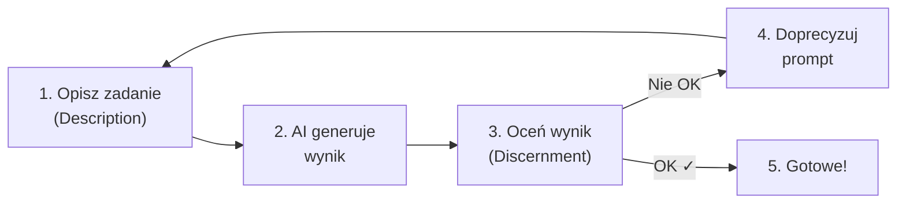

# 🎓 AI Fluency: Framework & Foundations — Kompletny Skrót (PL)

> **Źródło:** Anthropic Academy · Rick Dakan, Joseph Feller & Anthropic (2025)
> **Poziom:** Podstawy · Czas kursu: ~2-3h · Certyfikat na końcu

---

## 🧠 O co chodzi w kursie?

**AI Fluency** = umiejętność pracy z AI w sposób **efektywny, wydajny, etyczny i bezpieczny**.

Kurs uczy **Modelu 4D** — czterech kluczowych kompetencji, które pozwalają świadomie współpracować z AI (np. Claude) na każdym etapie: od planowania, przez komunikację, po weryfikację wyników.

---

## 🔑 Trzy tryby współpracy z AI

| Tryb | Co to znaczy | Przykład |
|------|-------------|---------|
| **Automation** | AI wykonuje konkretne zadanie wg Twoich instrukcji | „Napisz mi maila z podziękowaniem" |
| **Augmentation** | Ty + AI = partnerzy kreatywni | Wspólna burza mózgów nad projektem |
| **Agency** | AI działa samodzielnie w Twoim imieniu | Bot obsługujący klientów wg ustalonych reguł |

---

## 📐 Model 4D — Serce kursu

### 1️⃣ Delegation (Delegowanie)
> *Co oddać AI, a co zrobić samemu?*

**3 filary delegowania:**

| Filar | Pytanie które zadajesz |
|-------|----------------------|
| **Problem Awareness** | Jaki jest mój cel? Jakie kroki muszę podjąć? |
| **Platform Awareness** | W czym AI jest dobra, a gdzie ma ograniczenia? |
| **Task Delegation** | Jak strategicznie podzielić pracę? |

> [!TIP]
> **Złota zasada:** Celem NIE jest automatyzacja wszystkiego, ale stworzenie optymalnego partnerstwa człowiek-AI.

**Przykład promptu do ćwiczenia delegowania:**
```
Hej Claude, planuję [wstaw zadanie] i chcę przedyskutować z Tobą, 
które części powinienem zrobić sam, a które oddelegować do AI. 
Pomożesz mi stworzyć plan podziału pracy?
```

---

### 2️⃣ Description (Opisywanie / Promptowanie)
> *Jak precyzyjnie komunikować się z AI?*

**3 wymiary opisu:**

| Wymiar | Co definiujesz |
|--------|---------------|
| **Product Description** | CO chcesz dostać (format, długość, styl) |
| **Process Description** | JAK AI ma podejść do zadania (metoda, kroki) |
| **Interaction Description** | JAK chcesz współpracować (ton, rola, feedback) |

#### 🎯 6 Technik Skutecznego Promptowania

**1. Daj kontekst** — powiedz, kim jesteś i dlaczego pytasz
```
❌ "Napisz tekst o marketingu"
✅ "Jestem właścicielem małej firmy turystycznej. Potrzebuję tekst 
   reklamowy na stronę o domkach letniskowych nad morzem, 
   skierowany do rodzin z dziećmi"
```

**2. Określ format wyjścia**
```
❌ "Daj mi pomysły"
✅ "Daj mi 5 pomysłów w formie wypunktowanej listy, 
   każdy z krótkim opisem (2-3 zdania)"
```

**3. Nadaj AI rolę**
```
✅ "Jesteś doświadczonym copywriterem specjalizującym się 
   w branży turystycznej..."
```

**4. Podaj przykłady (few-shot)**
```
✅ "Oto przykład tonu, jakiego szukam: [przykład]. 
   Napisz coś podobnego na temat..."
```

**5. Dziel duże zadania na mniejsze kroki**
```
✅ "Krok 1: Najpierw zrób research na temat X. 
   Krok 2: Na tej podstawie napisz outline. 
   Krok 3: Rozwiń każdy punkt..."
```

**6. Iteruj i doprecyzowuj** — nie oczekuj perfekcji za pierwszym razem
```
✅ "Podoba mi się struktura, ale zmień ton na bardziej profesjonalny 
   i dodaj konkretne dane liczbowe"
```

---

### 3️⃣ Discernment (Rozeznanie / Ocena krytyczna)
> *Jak weryfikować to, co AI wygenerowała?*

**3 rodzaje oceny:**

| Rodzaj | Co sprawdzasz |
|--------|-------------|
| **Product Discernment** | Czy wynik jest dobry? Poprawny? Kompletny? |
| **Process Discernment** | Czy tok rozumowania AI miał sens? |
| **Performance Discernment** | Czy AI komunikuje się jasno i odpowiada na Twoje potrzeby? |

> [!CAUTION]
> **AI potrafi „halucynować"** — wymyślać fakty, podawać nieistniejące źródła, tworzyć błędne dane. ZAWSZE weryfikuj kluczowe informacje!

**Checklist weryfikacji wyników AI:**
- [ ] Czy fakty i dane są prawdziwe? (sprawdź źródła!)
- [ ] Czy niczego nie pominięto?
- [ ] Czy ton i styl pasują do celu?
- [ ] Czy logika rozumowania ma sens?
- [ ] Czy nie ma wewnętrznych sprzeczności?

---

### 4️⃣ Diligence (Staranność / Odpowiedzialność)
> *Jak korzystać z AI w sposób etyczny i odpowiedzialny?*

**Kluczowe aspekty:**

| Aspekt | O co chodzi |
|--------|-----------|
| **Transparency Diligence** | Bądź szczery o roli AI w Twojej pracy wobec osób, które powinny o tym wiedzieć |
| **Accuracy Diligence** | Bierz odpowiedzialność za dokładność treści wygenerowanych przez AI |
| **Ethical Diligence** | Dbaj o prywatność, uczciwość i brak dyskryminacji |

> [!IMPORTANT]
> Jeśli AI pomogła Ci napisać raport, tekst czy projekt — jasno komunikuj ten fakt klientom, przełożonym czy czytelnikom.

---

## 🔄 Pętla Description–Discernment (Kluczowy nawyk!)

To najważniejszy wzorzec pracy z AI w praktyce:



**Przykład w praktyce:**
1. Piszesz prompt → AI generuje tekst
2. Czytasz krytycznie → za ogólnikowy, brak szczegółów
3. Doprecyzowujesz → „Dodaj konkretne wymiary pokoi i odległość do plaży"
4. AI generuje poprawioną wersję → lepiej, ale ton za formalny
5. Kolejna iteracja → „Zmień na luźniejszy, przyjazny ton"
6. ✅ Wynik jest OK → finalna weryfikacja faktów (Diligence) → Gotowe!

---

## 🏋️ Praktyczne ćwiczenia z kursu

### Ćwiczenie 1: Test eksperta
Porozmawiaj z Claude o temacie, który **znasz doskonale**. Zwróć uwagę na:
- Kiedy AI poszerza Twoje myślenie? ✨
- Kiedy musisz ją **skorygować** jako ekspert? ⚠️

### Ćwiczenie 2: Nauka czegoś nowego
Poproś Claude o wyjaśnienie tematu, którego **nie znasz**. Obserwuj:
- Jak AI tłumaczy nowe pojęcia?
- Gdzie czujesz, że warto **zweryfikować** jej słowa?

### Ćwiczenie 3: Plan delegowania
1. Wybierz realne zadanie (np. napisanie prezentacji)
2. Otwórz czat z Claude i powiedz: *„Chcę zrobić X — pomóż mi podzielić to na kroki i ustalić, co robię ja, a co Ty"*
3. Stwórz plan podziału ról

### Ćwiczenie 4: Gry z AI 🎮
- **20 pytań** — Claude myśli o obiekcie, Ty zgadujesz
- **Zagadki** — zadaj zagadkę i obserwuj tok rozumowania AI
- **Koncepcje + ograniczenia** — np. *„Wytłumacz grawitację używając TYLKO metafor kulinarnych"*

---

## 📋 Odpowiedzi na quiz końcowy (13 pytań)

| # | Pytanie (skrót) | Odpowiedź |
|---|----------------|-----------|
| 1 | Czym jest AI Fluency? | Umiejętność pracy z AI efektywnie, wydajnie, etycznie i bezpiecznie |
| 2 | Jakie są 4D? | Delegation, Description, Discernment, Diligence |
| 3 | Która kompetencja = podział pracy człowiek vs AI? | **Delegation** |
| 4 | Na czym skupia się Diligence? | Odpowiedzialne użycie AI, przejrzystość i odpowiedzialność |
| 5 | Czym jest Problem Awareness? | Jasne zdefiniowanie celów ZANIM zaangażujesz AI |
| 6 | Która kompetencja = komunikacja z AI? | **Description** |
| 7 | Czym jest Product Description? | Jasne określenie, CO chcesz, żeby AI stworzyła |
| 8 | Która kompetencja = krytyczna ocena wyników? | **Discernment** |
| 9 | Czym jest Process Discernment? | Ocena, czy sposób rozumowania AI był skuteczny |
| 10 | Czym jest Transparency Diligence? | Szczerość o roli AI w Twojej pracy |

---

## 💡 Najważniejsze tipy do codziennej pracy z Claude

1. **Zanim napiszesz prompt** → zastanów się, czy to zadanie w ogóle warto delegować AI
2. **Bądź konkretny** → kontekst + format + rola + przykłady = lepsze wyniki
3. **Iteruj** → nie oczekuj perfekcji za pierwszym razem, korzystaj z pętli Description–Discernment
4. **Weryfikuj fakty** → AI może wymyślać dane — ZAWSZE sprawdzaj kluczowe informacje
5. **Buduj bibliotekę promptów** → zapisuj szablony, które działają, aby nie wymyślać koła od nowa
6. **Bądź transparentny** → informuj o użyciu AI tam, gdzie to ma znaczenie
7. **Traktuj AI jak partnera** → najlepsze wyniki powstają z dialogu, nie z jednorazowych poleceń

---

> *Kurs „AI Fluency: Framework & Foundations" — Anthropic Academy 2025*
> *Skrót przygotowany jako szybka referencja do codziennej pracy z AI*
